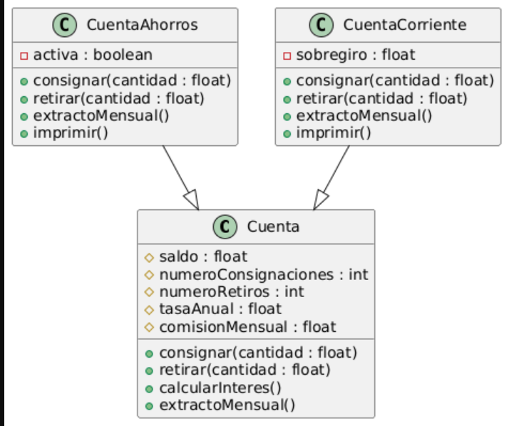

# Ejercicio Cuenta Bancaria - POO

Proyecto desarrollado en **Java usando Maven** que modela un sistema de cuentas bancarias aplicando **herencia y programación orientada a objetos**.

## Clases del sistema

### Cuenta

Clase base que contiene:

* saldo
* numeroConsignaciones
* numeroRetiros
* tasaAnual
* comisionMensual

Métodos:

* consignar()
* retirar()
* calcularInteres()
* extractoMensual()

### CuentaAhorros

Extiende la clase **Cuenta**.

Atributo adicional:

* activa : boolean

### CuentaCorriente

Extiende la clase **Cuenta**.

Atributo adicional:

* sobregiro : float

